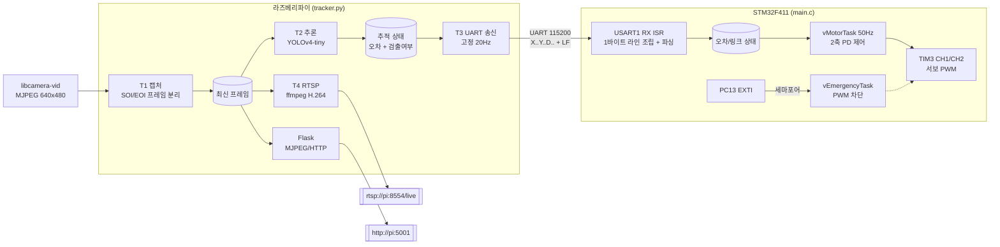

# 사람 추적 팬/틸트 카메라

라즈베리파이가 카메라 영상에서 사람을 검출해 **화면 중앙 대비 픽셀 오차**를 계산하고,
STM32가 이 오차를 받아 **2축 서보를 제어**해 대상을 화면 중앙에 유지하는 시스템입니다.
영상은 **RTSP(H.264)** 와 **MJPEG over HTTP** 두 경로로 동시에 송출됩니다.

---

## 이 저장소에서 직접 작성한 코드

CubeMX가 생성한 HAL 드라이버/FreeRTOS가 대부분을 차지하므로, 실제 작성 부분만 안내합니다.

| 파일 | 내용 |
|---|---|
| [`Core/Src/main.c`](Core/Src/main.c) | STM32 전체 — UART 수신 ISR, 패킷 파싱, PD 제어 태스크, 비상정지 |
| [`raspberry_pi/tracker.py`](raspberry_pi/tracker.py) | 파이 전체 — 캡처, YOLO 추론, UART 송신, RTSP 송출, MJPEG 웹 |
| [`raspberry_pi/mediamtx.yml`](raspberry_pi/mediamtx.yml) | RTSP 서버 설정 |

나머지(`Drivers/`, `Middlewares/`)는 STM32CubeMX 생성 코드입니다.

---

## 시스템 구성

### 하드웨어

| 구성 | 사양 |
|---|---|
| SBC | Raspberry Pi + CSI 카메라 (`libcamera-vid`) |
| MCU | STM32F411RE (Nucleo-64), 84MHz, FreeRTOS(CMSIS-RTOS v2) |
| 구동부 | 팬/틸트 2축 서보 (표준 50Hz, 500~2500µs) |
| 연결 | UART 115200 8N1 — Pi `/dev/serial0` ↔ STM32 `USART1` |

### 핀 배치

| 신호 | STM32 핀 | 비고 |
|---|---|---|
| 팬(X축) 서보 PWM | PA6 | TIM3_CH1 |
| 틸트(Y축) 서보 PWM | PA7 | TIM3_CH2 |
| UART TX / RX | PA9 / PA10 | USART1 |
| 비상정지 버튼 | PC13 | B1 (EXTI, rising) |
| 상태 LED | PA5 | LD2 |

### 데이터 흐름



---

## 통신 프로토콜

ASCII 개행 구분 방식입니다.

```
X<오차x>Y<오차y>D<검출>\n        예) X-120Y45D1\n
```

| 필드 | 의미 |
|---|---|
| `오차x` | 대상 중심 x − 320 (화면 중앙 기준, 음수 = 왼쪽) |
| `오차y` | 대상 중심 y − 240 (음수 = 위쪽) |
| `검출` | `1` = 사람 검출됨, `0` = 미검출 |

- 파이는 **검출 여부와 무관하게 20Hz로 항상 송신**합니다. 패킷이 오는지 여부 자체가
  링크 생존 신호(keepalive)이기 때문입니다.
- STM32는 `D` 필드가 없는 구버전 패킷(`X..Y..`)도 파싱해 하위 호환을 유지합니다.

---

## 설계 판단과 근거

### 1. 제어 연산을 파이가 아닌 STM32에 둔 이유

파이는 "대상이 어디에 있는가"만 계산하고, "얼마나 움직일 것인가"는 STM32가 결정합니다.

추론 속도는 프레임 내용과 CPU 부하에 따라 흔들리지만(수 fps ~ 수십 fps),
PD 제어의 미분항은 **일정한 샘플링 주기**를 전제로 합니다.
제어를 파이에 두면 추론이 느려질 때 미분항이 왜곡되고, 리눅스 스케줄러 지터까지 얹힙니다.
STM32의 `vMotorTask`는 `osDelay(20)`으로 정확히 50Hz를 유지하므로
추론 속도와 무관하게 제어 주기가 고정됩니다.

### 2. `cv2.VideoCapture` 대신 파이프에서 직접 프레임을 잘라낸 이유

`libcamera-vid`를 subprocess로 띄우고 stdout을 직접 읽습니다.
MJPEG 스트림은 프레임 경계가 명시되지 않으므로 JPEG 마커로 직접 분리합니다.

| 마커 | 바이트 | 의미 |
|---|---|---|
| SOI | `FF D8` | Start of Image |
| EOI | `FF D9` | End of Image |

```python
soi = buf.find(b"\xff\xd8")
eoi = buf.find(b"\xff\xd9", soi + 2) if soi != -1 else -1
if soi != -1 and eoi != -1:
    jpg = buf[soi:eoi + 2]
    buf = buf[eoi + 2:]
```

당시 라즈베리파이 카메라 스택이 V4L2 경로에서 불안정해 `VideoCapture`가 프레임을 놓치는
문제가 있었고, `libcamera-vid`를 직접 쓰는 쪽이 안정적이었습니다.
부수적으로 해상도·프레임레이트·코덱을 CLI 인자로 정확히 통제할 수 있습니다.

### 3. 캡처 / 추론 / 송신을 별도 스레드로 나눈 이유

| 스레드 | 주기 | 분리 이유 |
|---|---|---|
| T1 캡처 | 카메라 속도 | 추론이 느려도 최신 프레임은 계속 갱신되어야 함 |
| T2 추론 | 가변 (모델 속도) | 가장 느린 단계. 여기에 다른 것을 묶으면 전부 같이 느려짐 |
| T3 UART 송신 | **고정 20Hz** | 링크 감시 신호이므로 주기가 흔들리면 안 됨 |
| T4 RTSP | 고정 15Hz | 인코더는 일정한 입력 레이트를 전제로 함 |

핵심은 **T2와 T3의 분리**입니다.
송신을 추론 루프에 묶으면 추론이 느려질 때 송신 주기도 같이 늘어나고,
STM32 입장에서는 "추론이 느린 것"과 "파이가 죽은 것"을 구분할 수 없게 됩니다.
송신을 독립시켜야 링크 타임아웃이 장애 판정 기준으로 성립합니다.

프레임 공유는 **항상 새 객체로 교체하고 소비자는 절대 in-place 수정하지 않는** 규칙으로,
락 구간을 참조 교체로만 한정했습니다. 복사 비용은 락 밖에서 발생합니다.

### 4. ISR에서 세마포어만 던지고 실제 처리는 태스크에서 하는 이유

```c
void HAL_GPIO_EXTI_Callback(uint16_t GPIO_Pin)
{
  if (GPIO_Pin == GPIO_PIN_13)
    osSemaphoreRelease(myEmergencySemHandle);   // ISR은 여기서 끝
}
```

비상정지의 실제 동작(PWM 정지, 플래그 설정, LED 제어)은 우선순위 `osPriorityHigh`인
`vEmergencyTask`가 수행합니다. ISR을 짧게 유지해야 다른 인터럽트(특히 UART 수신)의
응답 지연을 막을 수 있고, HAL 함수 중에는 ISR 컨텍스트에서 호출하면 안 되는 것들이 있습니다.

### 5. UART 오버런(ORE) 장애와 복구 — 가장 오래 잡았던 문제

**증상**: 정상 동작하다가 수십 초 뒤 UART 수신이 완전히 멈추고, 리셋 전까지 복구되지 않음.

**원인**: HAL의 인터럽트 수신(`HAL_UART_Receive_IT`)은 1바이트를 받으면 수신을 종료하고,
콜백에서 다시 무장해야 이어집니다. 그런데 처리가 지연된 사이 다음 바이트가 도착하면
**ORE(Overrun Error)** 가 발생하고, HAL은 `RxCpltCallback` 대신 `ErrorCallback`으로 빠집니다.
이때 재무장을 하지 않으면 수신 상태 머신이 `READY`로 돌아간 채 영구히 멈춥니다.

**해결**:

```c
void HAL_UART_ErrorCallback(UART_HandleTypeDef *huart)
{
  if(huart->Instance == USART1)
  {
    __HAL_UART_CLEAR_OREFLAG(huart);
    __HAL_UART_CLEAR_FEFLAG(huart);
    __HAL_UART_CLEAR_NEFLAG(huart);
    HAL_UART_Receive_IT(&huart1, &rx_data, 1);   // 파이프라인 재시동
  }
}
```

에러 플래그를 클리어하고 수신을 재무장합니다. 플래그를 지우지 않으면
인터럽트가 즉시 재발생해 무한 루프에 빠지므로 클리어가 먼저입니다.

### 6. 타겟 소실 드리프트

**증상**: 사람이 프레임 밖으로 나가면 카메라가 그 방향으로 계속 회전해 한계각까지 밀려감.

**원인**: 제어 루프가 `x_current += x_control` 구조로, 제어 출력을 각도에 **누적**합니다
(엄밀히는 PD가 아니라 속도형(velocity form) 제어기).
기존 구현은 검출됐을 때만 패킷을 보냈으므로, 사람이 사라지면 STM32에 마지막 오차가
그대로 남고 매 주기 계속 적분되어 클램프 한계까지 이동했습니다.

**해결** — 두 가지 실패 모드를 구분해 처리:

| 실패 모드 | 감지 방법 | 동작 |
|---|---|---|
| 타겟 소실 (사람 없음) | 파이가 `D0` 송신 | 오차 0, 현재 각도 유지 |
| 링크 두절 (파이 다운·케이블 탈락) | 300ms 동안 유효 패킷 없음 | 오차 0, 현재 각도 유지 |

```c
if ((HAL_GetTick() - rpi_last_rx_tick) > RPI_LINK_TIMEOUT_MS)
  tracking = 0;                  // 링크 두절
else
  tracking = rpi_target_valid;   // 타겟 검출 여부

if (tracking) {
  x_error = -(double)rpi_err_x;
  y_error =  (double)rpi_err_y;
} else {
  x_error = 0.0;  x_prev_error = 0.0;   // 미분기까지 리셋
  y_error = 0.0;  y_prev_error = 0.0;
}
```

오차만 0으로 두지 않고 `prev_error`까지 리셋하는 이유는, 오차가 급변할 때
미분항이 튀는 것(derivative kick)을 막기 위해서입니다.

`HAL_GetTick() - rpi_last_rx_tick`은 부호 없는 뺄셈이므로 약 49.7일 후
틱 카운터가 오버플로우해도 차이값은 정상적으로 계산됩니다.

### 7. RTSP와 MJPEG을 함께 두는 이유

| | MJPEG over HTTP | RTSP (H.264) |
|---|---|---|
| 시청 | 브라우저에서 바로 | VLC/ffplay/NVR 필요 |
| 대역폭 | 큼 (프레임 단위 JPEG) | 작음 (프레임 간 압축) |
| 지연 | 낮음 | 낮음 (`zerolatency`, B프레임 제거) |
| 용도 | **현장 디버깅** | **실사용 스트리밍** |

디버깅 중에는 브라우저에서 바로 열리는 MJPEG이 압도적으로 빠르고,
장시간 운용·다중 시청자·NVR 연동에는 RTSP가 맞습니다. 두 경로 모두
동일한 주석 프레임(`draw_overlay()`)을 공유합니다.

RTSP는 두 가지 모드를 지원합니다.

- `push` (기본) — MediaMTX 등 RTSP 서버에 푸시. 다중 시청자에 안정적.
- `listen` — ffmpeg 자체가 RTSP 서버로 대기. 외부 의존성이 없지만 단일 시청자용.

---

## 제어 파라미터

### PWM 타이밍

```
TIM3 클럭 = 84MHz
  (APB1 = 42MHz이지만 APB1 프리스케일러가 1이 아니면 타이머 클럭은 2배 = 84MHz)

Prescaler = 83   ->  84MHz / (83+1) = 1MHz   (1틱 = 1µs)
Period    = 19999 ->  20000틱 = 20ms = 50Hz  (표준 서보 주기)

각도 -> 펄스폭:  pulse_us = 각도 * 11.111 + 500
                 0° -> 500µs,  90° -> 1500µs,  180° -> 2500µs
```

### PD 게인

| 축 | Kp | Kd | 각도 클램프 |
|---|---|---|---|
| X (팬) | 0.0008 | 0.0002 | 5° ~ 175° |
| Y (틸트) | 0.0006 | 0.0002 | 5° ~ 175° |

최대 오차(320px)일 때 사이클당 약 0.26°, 50Hz 기준 최대 약 **13°/s**로
의도적으로 보수적으로 잡아 진동을 억제했습니다.

게인 값은 실측 기반 튜닝이 아니라 진동이 나지 않는 선에서 보수적으로 잡은 값입니다.
스텝 응답을 측정해 정착 시간과 오버슈트를 기준으로 재튜닝하는 것이 남은 과제이며,
측정 방법은 아래 '알려진 한계 / 다음 단계'에 정리했습니다.

---

## 실행 방법

### 라즈베리파이

```bash
cd raspberry_pi
pip install -r requirements.txt
./fetch_model.sh                 # YOLOv4-tiny 가중치 다운로드 (24MB)
```

RTSP 서버(MediaMTX)를 먼저 띄웁니다.

```bash
./mediamtx mediamtx.yml
```

추적 프로그램 실행:

```bash
python3 tracker.py
```

| 확인 경로 | 주소 |
|---|---|
| MJPEG (브라우저) | `http://<파이IP>:5001` |
| RTSP (VLC/ffplay) | `rtsp://<파이IP>:8554/live` |

MediaMTX 없이 ffmpeg만으로 띄우려면:

```bash
RTSP_MODE=listen RTSP_URL=rtsp://0.0.0.0:8554/live python3 tracker.py
```

주요 환경변수: `FRAME_W` `FRAME_H` `INPUT_SIZE` `CONF_TH` `SERIAL_PORT` `TX_HZ`
`RTSP_ENABLE` `RTSP_MODE` `RTSP_URL` `RTSP_FPS` `HTTP_PORT`

파이의 UART를 쓰려면 `raspi-config`에서 시리얼 콘솔은 끄고 시리얼 하드웨어는 켜야 합니다.

### STM32

Keil MDK-ARM(`MDK-ARM/my_project.uvprojx`) 또는 `make`로 빌드 후 Nucleo에 플래시합니다.

```bash
make
```

---

## 알려진 한계 / 다음 단계

- [ ] **프로토콜 무결성 검증 없음** — 체크섬이 없어 노이즈로 깨진 값이 제어에 그대로 반영됨. XOR 1바이트 추가 예정
- [ ] **데드밴드 없음** — 대상이 중앙 부근일 때 미세 진동. `|오차| < 15px`이면 0 처리 필요
- [ ] **비상정지 해제 불가** — `is_emergency`가 1이 되면 리셋 외 복귀 경로가 없음
- [ ] **다중 인원 추적 전환** — 현재는 가장 큰 박스를 선택. 대상이 바뀔 때 부드러운 전환 없음
- [ ] **PD 게인 근거 부족** — 스텝 응답 측정 후 정착 시간/오버슈트 기준으로 재튜닝 필요
- [ ] **파서 단위 테스트 없음** — 패킷 파싱을 분리해 호스트에서 테스트 가능하게

---

## 변경 이력

| 버전 | 내용 |
|---|---|
| v2 | RTSP(H.264) 송출 추가, 프로토콜에 검출 플래그 추가, 타겟 소실 드리프트 해결, UART 송신 스레드 분리, 최대 박스 선택 |
| v1 | YOLOv4-tiny 사람 검출, MJPEG 웹 스트리밍, UART 오차 전송, STM32 PD 제어, 비상정지 |
